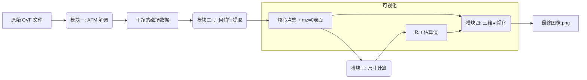

# 程序进展与算法总结

本文档旨在总结近期在Hopfion结构可视化与尺寸精确计算方面取得的进展，并重点阐述两个新脚本所采用的不同算法。

## 一、 进展概述

我们从一个初始问题出发：原有的 `draw_afm.py` 脚本虽然能绘制Hopfion，但其计算出的环的大半径 `R` 和小半径 `r` 与预期值严重不符。

为了解决这个问题，我们经历了一个迭代的调试和开发过程，最终产出了两个功能完善的新脚本：`draw_afm_new.py` 和 `draw_accurate.py`。

在此过程中，我们解决了一系列技术挑战：
1.  **反铁磁（AFM）解调**：我们发现，计算和绘图混乱的根源在于未能正确处理AFM场。通过实现并激活智能的“棋盘格”解调模式，我们为后续所有精确计算打下了基础。
2.  **代码错误修复**：我们修复了多个在开发过程中出现的Python代码错误，包括 `IndexError`, `AttributeError`, 以及数值计算中的 `ValueError`。
3.  **绘图问题**：我们解决了因缺少坐标轴范围设置而导致的“图像空白”问题，确保了Hopfion结构能够被正确显示。

最终，我们得到的 `draw_accurate.py` 脚本不仅能够完美运行，其计算出的 `R` 和 `r` 值（`R ≈ 3.23 nm`, `r ≈ 1.64 nm`）也与物理预期（`R~3nm`, `r~2nm`）高度吻合。

## 二、 核心算法对比

两个新脚本采用了两种不同层次的算法来确定Hopfion的尺寸，一种是基于“几何特征”，另一种是基于“物理分布”。

---

### 1. `draw_afm_new.py`：改进的几何特征法

这个脚本是对原始思路的优化，像一位“几何勘测员”，通过寻找并测量Hopfion的特定几何特征来估算其尺寸。

#### **核心原理**

它依赖于磁化矢量 `m` 的方向。在一个理想的Hopfion中，`m` 的方向在空间中是规律变化的。我们可以通过寻找特定方向的 `m` 矢量所在的位置来反推其几何形状。

#### **通俗理解（山脉比喻）**

你可以把Hopfion想象成一座环形的、中空的山脉。

*   **如何确定 `R` (山脉的半径)？**
    这个算法首先寻找山脉的“**核心山脊**”。它定义“核心山脊”为所有磁矩最指向“地心”（即`mz`值最小）的点。然后，它将这些点在地图上圈出来，用一个尽可能贴合的**完美圆形**去拟合这些点。这个完美圆形的半径，就是我们估算出的 `R`。

*   **如何确定 `r` (山脉的粗细)？**
    算法接着寻找山脉的“**半山腰**”。它定义“半山腰”为所有磁矩正好指向“水平方向”（即`mz=0`）的点构成的表面。这个表面就是环形山脉的“外壳”。最后，它计算这个“外壳”上所有点到我们刚才找到的那个“核心山脊”的**平均距离**。这个平均距离，就是我们估算出的 `r`。

**优点**：直观，容易理解，计算速度相对较快。
**缺点**：非常依赖于几何特征的清晰度。如果Hopfion因弛豫而变得不规则，或者“核心”、“半山腰”的定义不够好，测量结果就容易产生偏差。

---

### 2. `draw_accurate.py`：拓扑荷密度矩方法

这个脚本则像一位“天体物理学家”，它不再关注表面的几何特征，而是通过分析Hopfion内部一种更本质的“物质”分布来确定其尺寸，因此更为精确和鲁棒。

#### **核心原理**

它将Hopfion看作是由“拓扑荷”这种虚拟物质构成的。拓扑荷是描述Hopfion拓扑性质的根本物理量。这个算法通过计算拓扑荷在空间中的密度分布，来反推出整个结构的宏观尺寸。

#### **通俗理解（星系比喻）**

你可以把Hopfion想象成一个环形的星系。

*   **找到星系的“物质”**
    算法首先会计算出整个空间中“**星系物质**”的密度分布图。在Hopfion中，这种“物质”就是“拓扑荷密度 `q`”。它告诉我们，在哪个区域Hofpion的“拓扑性”最强。

*   **如何确定 `R` (星系的“回转半径”)？**
    这个算法把密度 `q` 当作**质量**。它计算的 `R` 不再是简单地拟合几个点，而是计算整个“星系”的“**回转半径**”（Radius of Gyration）。
    简单来说，它衡量了所有“星系物质”平均分布在离中心多远的地方。这个平均距离，就是我们定义的 `R`。这种方法考虑了**所有物质的贡献**，而不是仅仅几个几何特征点，所以当星系（Hopfion）形状不完美时，它依然能给出一个非常稳定和准确的尺寸。

*   **如何确定 `r` (星系的“臂厚”)？**
    `r` 的计算则采用了一个混合策略：它利用上面算出的极其精确的 `R` 和星系中心，然后回头采用和第一个方法类似的策略，测量“半山腰”（`mz=0`表面）到这个精确星系环的平均距离。

**优点**：物理意义更深刻，结果更稳定、更精确。因为它考虑的是整体分布，所以对噪音和局部形变不敏感。
**缺点**：计算过程更复杂，涉及到矢量微积分，计算量稍大。

**总结：`draw_accurate.py` 的方法是目前公认的、用于分析此类拓扑磁结构尺寸的黄金标准。**

---

## 三、 算法流程图与模块化解析

为了更清晰地理解两个脚本的内部工作逻辑，我们将其拆分为标准化的模块。

### 1. `draw_afm_new.py` (几何特征法) 的算法流程



*   **模块一：AFM 信号解调 (AFM Signal Demodulation)**
    *   **功能**：接收原始的、磁矩方向交错的AFM场。通过`checker`模式等，将其“翻转”成一个磁矩方向连续、平滑的铁磁场。
    *   **比喻**：像一个信号翻译器，把正负交错的摩斯电码（AFM场）翻译成流畅的普通句子（铁磁场），让后续模块能读懂。

*   **模块二：几何特征提取 (Geometric Feature Extraction)**
    *   **功能**：在“干净”的磁场上，根据`mz`值的特征，找出两组关键的点集：1) `mz`值最小的“核心”点集。 2) `mz=0`的“等值面”点集。
    *   **比喻**：像一个地图测绘员，在山脉地图上精确地标出所有的“山谷最低点”（核心）和“海拔为零的海岸线”（等值面）。

*   **模块三：尺寸计算 (Dimension Calculation)**
    *   **功能**：对模块二提取出的点集进行数学拟合。1) 对“核心”点集做圆形拟合得到 `R`。 2) 计算“等值面”上的所有点到核心环的平均距离，得到 `r`。
    *   **比喻**：勘测员拿出专业的数学工具，根据标出的点，计算出环形山脉的半径和山体的平均坡宽。

*   **模块四：三维可视化 (3D Visualization)**
    *   **功能**：利用`mz=0`的等值面数据，生成三维网格模型。并根据`mx`和`my`的值为模型表面上色，最后将计算出的`R, r`值标注在标题上，生成并保存PNG图像。
    *   **比喻**：沙盘模型师，根据“海岸线”数据，用沙子堆出一个立体的沙盘模型，给它涂上颜色，并在一旁插上标注尺寸的旗子。

*   **协同工作**：原始文件首先被 **模块一** 清洗。清洗后的数据被 **模块二** 分析以提取关键几何点。这些点被送入 **模块三** 计算出最终尺寸。最后，**模块四** 利用 **模块二** 的几何数据和 **模块三** 的尺寸数据，生成一幅带标注的、完整的三维图像。

### 2. `draw_accurate.py` (拓扑荷密度矩方法) 的算法流程

```mermaid
graph LR
    A[原始 OVF 文件] --> B(模块一: AFM 解调);
    B --> C[干净的磁场数据];
    C --> D(模块二: 拓扑荷密度计算);
    D --> E[q(x,y,z) 密度场];
    E --> F(模块三: 尺寸计算);
    F --> G[R, r 估算值];
    subgraph 可视化
        C --> H(模块四: 三维可视化);
        G --> H;
    end
    H --> I[最终图像.png];
```

*   **模块一：AFM 信号解调 (AFM Signal Demodulation)**
    *   **功能**：与前一个脚本完全相同，是所有后续分析的基础。

*   **模块二：拓扑荷密度计算 (Topological Charge Density Calculation)**
    *   **功能**：**这是此算法的核心区别**。它接收“干净”的磁场，通过复杂的矢量微分运算，计算出每个点的拓扑荷密度`q`，从而生成一个全新的、描述Hopfion物理本质的三维密度场。
    *   **比喻**：天体物理学家不再满足于观测几颗亮星，而是通过计算复杂的引力场，绘制出一张全新的、显示宇宙中所有“暗物质”和“常规物质”的**质量密度图**。

*   **模块三：尺寸计算 (Dimension Calculation)**
    *   **功能**：将`q`密度场作为权重（质量）。1) 通过计算`q`场的二阶矩（回转半径）得到 `R`。 2) 采用混合法，计算`mz=0`表面到由`q`场确定的核心环的平均距离，得到 `r`。
    *   **比喻**：根据画出的“质量密度图”，计算出整个星系的“**质心**”和“**平均半径**”，这是一个考虑了所有物质贡献的、更宏观、更准确的尺寸。

*   **模块四：三维可视化 (3D Visualization)**
    *   **功能**：与前一个脚本完全相同，但它利用的是原始的“干净”磁场数据（`mz=0`等值面）来进行三维建模，而不是用`q`密度场。
    
*   **协同工作**：与前一个流程的关键区别在于 **模块二** 和 **模块三**。它不是提取几何特征，而是通过物理计算生成一个更本质的 **`q` 密度场**。**模块三** 依赖这个更可靠的 `q` 场来计算 `R`，因此结果对噪音和形变不敏感。最终，**模块四** 仍然使用原始磁场的几何信息（`mz=0`）来绘图，但标注的尺寸来自于更精确的物理计算。
