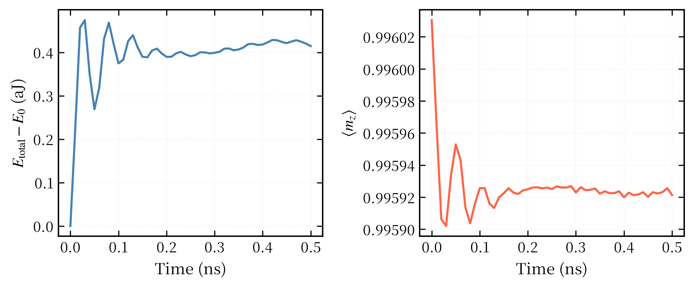
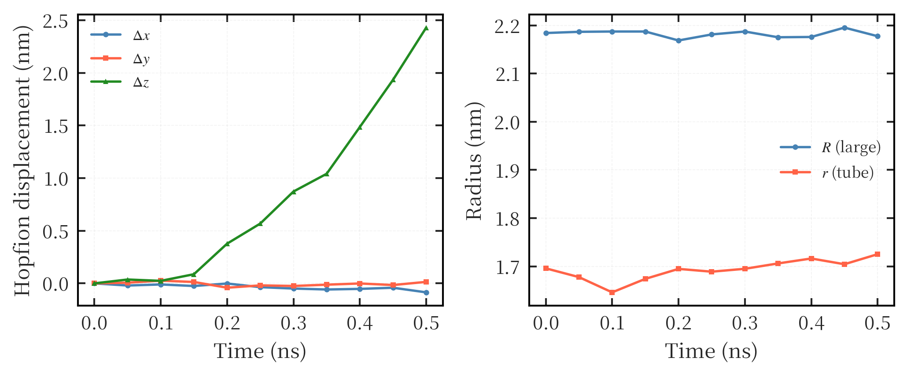

# 自旋波驱动 Hopfion 仿真示例

本目录给出一个可复现的 Mumax3 算例，用自旋波驱动居中的 Q_H=1 Hopfion，并分析其能量响应、空间位移和结构稳定性。这个算例用于支撑汇报中“自旋波可以驱动 Hopfion 发生可控运动”的基础现象。

## 研究目标

- 建立一个最小可复现的自旋波驱动 Hopfion 仿真。
- 比较平面波源和点源两种激发几何。
- 提取 Hopfion 的能量响应、净磁化响应、轨迹位移和 R/r 半径演化。
- 验证自旋波驱动下 Hopfion 是否主要发生平移，而不是立即结构坍塌。

## 文件说明

| 文件或文件夹 | 作用 |
|---|---|
| `initial_hopfion.ovf` | 居中稳定的 Q_H=1 frustrated-FM Hopfion 初始态 |
| `plane_wave_drive.mx3` | 平面波源驱动脚本，源位于 x 方向左侧薄层 |
| `point_source_drive.mx3` | 点源驱动脚本，源为单个网格点 |
| `analyze_energy.py` | 从 `table.txt` 提取总能量和净磁化随时间的变化 |
| `analyze_trajectory.py` | 从 OVF 序列提取 Hopfion 位移和 R/r 半径演化 |
| `example_result/` | 汇报用示例图，原始 OVF、日志和 table 已清理 |
| `Zhang et al. 2023 ... .pdf` | 相位相关轨迹提取方法的参考文献 |

## 主要仿真参数

| 项目 | 设置 |
|---|---|
| 体系尺寸 | `100 x 100 x 100` cells |
| 网格尺寸 | `0.5 nm` |
| 几何尺寸 | `50 nm` 立方体 |
| 初始态 | `initial_hopfion.ovf` |
| 拓扑荷 | Q_H=1 |
| 易轴 | z 方向 |
| 阻尼 | 体内 `alpha=0.001`，六面吸收边界 `alpha=100` |
| 平面波源 | `x=-10 nm` 附近薄层，沿 x 方向振荡 |
| 点源 | 单个网格点 `(30, 50, 50)`，沿 x 方向振荡 |
| 输出 | OVF 每 50 ps，table 每 10 ps |

更完整的材料参数和交换相互作用设置见两个 `.mx3` 文件顶部注释。

## 示例结果

当前 `example_result/` 只保留汇报用图片，不保留原始过程文件。示例来自平面波源驱动结果。

示例现象是：自旋波沿 +x 传播时，Hopfion 主要沿 z 方向发生横向漂移，表现出类 Hall 运动；同时 R/r 基本保持稳定，说明该参数下自旋波能够驱动 Hopfion 平移，而不是立即破坏其结构。

## 注意事项

- `example_result/` 中的原始 `m*.ovf`、`table.txt` 和 `log.txt` 已清理，因此默认示例图只能用于查看结果，不能直接重新分析。
- 如果需要复现分析，请先重新运行 `.mx3` 脚本生成新的 `.out` 目录，再把该目录传给分析脚本。
- `analyze_trajectory.py` 使用相位相关法追踪 Hopfion 刚体平移，对传播中的自旋波背景比简单质心法更稳健。
- 分析脚本依赖共享库 `/mnt/d/Research/Hopfion/95_shared_scripts/`。
