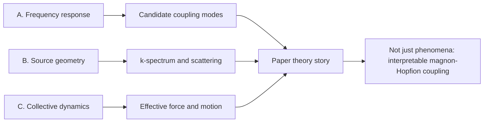

# Hopfion 自旋波驱动 paper 理论主线指导

生成日期：2026-06-08  
关联 bd：`Hopfion-vk3`  
项目对象：`/mnt/d/Research/Hopfion/20260105_frustrated_fm/spin_wave_dynamics/`

## 0. 核心目标

当前项目已经有 frustrated FM 条件下 Q_H=1 Hopfion 的自旋波驱动现象，包括平面源与点源、频率扫描、幅度扫描、多频率切换控制。下一步若要发更好的 paper，不能只堆现象图，而要把这些现象组织成一条理论可解释的主线。

建议 paper 核心问题写成：

> Frustrated ferromagnetic Hopfion can be driven by spin waves through a frequency-selective and source-geometry-dependent magnon-Hopfion coupling. The observed motion is governed by internal-mode coupling, spin-wave k-spectrum/scattering, and generalized collective-coordinate dynamics.

中文理解就是：Hopfion 不是“被波随便推走”，而是“在某些频率、某些入射波矢、某些极化条件下，与自旋波发生选择性耦合，然后通过拓扑动力学表现为可控漂移、反向、甚至强激发坍塌”。

## 1. 当前已有现象证据

| 现象块 | 已有结果 | 当前证据强度 | 论文中应如何表述 |
|---|---|---|---|
| 方向选择性 | `vibX` 强耦合，`vibZ` 基本无耦合 | 强 | Hopfion 自旋波耦合存在明显极化/方向选择定则 |
| 平面源 `srcX` 频扫 | 100-200 GHz 和 1000 GHz 强，400-600 GHz 弱 | 强 | 频率响应存在多窗口；200 GHz 有能量吸收支持，1000 GHz 是强位移窗口 |
| 平面源 `srcZ` 频扫 | 100 GHz 推 +z，1100 GHz 推 -z 且最强 | 强 | 同一源方向下不同频率可切换有效运动方向 |
| 点源频扫 | `srcX` 峰从 1000 红移到 700 GHz，`srcZ` 峰从 1100 红移到 800 GHz | 中强 | 源几何改变有效 k 谱，导致响应峰位变化 |
| 幅度扫描 | 旧 `v ~ B^1.99` 只基于窄数据，已标记不足 | 中等 | 可讨论弱驱动近似二次强度效应，但不能作为严格标度律 |
| `freq_switch v3` | 100 GHz 推 +z，1100 GHz 反向，但 t≈0.91 ns 坍塌 | 强 | 频率控制有效，同时揭示强耦合窗口存在拓扑形变阈值 |

## 2. 总体理论框架

三条研究主线应合并成一个逻辑闭环。



### 主线 A：频率扫描与固有/共振频率

研究问题：我们扫到的 100/200/700/800/1000/1100 GHz 到底是什么？

客观结论：

- 不能直接把所有位移峰叫作 Hopfion 固有频率。
- `srcX 200 GHz` 有位移响应和能量吸收双重支持，可作为候选 resonant coupling frequency。
- `srcZ 100 GHz` 有位移异常和能量吸收提示，但需要复核 `E_total` 斜率符号和拟合窗口。
- `srcX 1000 GHz`、`srcZ 1100 GHz` 更像 strong drive-response windows，可能混合了内部模式、散射推力、传播效率和非线性形变。

对应深入文件：`hopfion_spinwave_paper_theory_guidance_20260608/A_frequency_modes.md`

### 主线 B：点源 vs 平面源

研究问题：为什么点源和平面源峰位不同？

客观结论：

- 没有找到可以完全一一照搬的“单 skyrmion 点源 vs 平面源”理论论文。
- 但 skyrmion 自旋波驱动和 magnon-skyrmion scattering 文献足以支持一个谨慎解释：平面源近似窄 `k`、窄方向的入射；点源是局域激发，天然带宽 `k`、宽角度、强近场分量。
- 因此点源红移不是“Hopfion 固有频率变了”，而是“源几何改变了可耦合 magnon 谱和散射矩阵元”。
- 由于点源使用 500 T 单格、平面源使用 1 T 薄层，两者绝对效率不能直接比较，只能比较峰位和方向分布。

对应深入文件：`hopfion_spinwave_paper_theory_guidance_20260608/B_point_vs_plane.md`

### 主线 C：Thiele 方程与动力学解释

研究问题：为什么 Hopfion 的运动方向不只是沿自旋波传播方向？

客观结论：

- Skyrmion 的 Thiele 方程可以作为“拓扑结构受到 magnon 力后的低维动力学”参考。
- 但 Hopfion 是三维拓扑结构，不能直接套 2D skyrmion 的 `G x v` 公式。
- 更合理的写法是广义集体坐标方程：质心、环半径、管半径、扭转相位共同参与动力学。
- 文献中 Hopfion STT 研究已经明确显示 translation、transverse motion、rotation、dilation 互相耦合；这可作为我们解释自旋波驱动下复杂运动的理论支点。

对应深入文件：`hopfion_spinwave_paper_theory_guidance_20260608/C_thiele_dynamics.md`

## 3. 建议 paper 叙事

### 3.1 不是“扫频现象”，而是“magnon-Hopfion coupling spectrum”

频率扫描不要写成“我们试了很多频率，发现哪个大哪个小”。应写成：自旋波频率改变了入射 magnon 的能量、波矢、传播效率和与 Hopfion 内部模式的耦合强度，因此 Hopfion motion 显示出选择性频率窗口。

### 3.2 点源和平面源不是工程细节，而是物理控制旋钮

平面源更适合研究清晰模式，因为波矢方向更纯。点源更接近真实纳米天线，但它的 k 谱更宽，因此看到的峰位可能红移，方向分布也更复杂。这个对比可以成为 paper 的亮点。

### 3.3 Thiele 理论用于解释“力-运动映射”，不是强行拟合全部数据

我们的数据还不足以给出完整解析方程拟合。可先建立定性/半定量的广义 Thiele 图像：

```text
topological texture + incoming magnon current
        -> magnon momentum/angular-momentum transfer
        -> generalized force on Hopfion collective coordinates
        -> translation + transverse drift + internal deformation
```

## 4. 需要补做的分析

优先顺序建议：

1. **能量吸收谱复核**  
   重新计算 `dE/dt`，统一拟合窗口，同时报告符号和绝对值。目标是确认 `200 GHz srcX` 与 `100 GHz srcZ` 是否真正是吸收峰。

2. **脉冲自由振荡 FFT**  
   用短脉冲激发 Hopfion，关场后看 `center(t)`、`R(t)`、`r(t)`、`E(t)` 的 PSD。目标是区分固有频率和驱动响应峰。

3. **平面源/点源 k 谱分析**  
   在无 Hopfion 或远离 Hopfion 的区域，对 spin wave 做空间 FFT。目标是证明点源宽 k 谱、平面源窄 k 谱。

4. **模式空间图**  
   对候选频率做 cell-wise FFT amplitude/phase map，查看振幅是否局域在 Hopfion core/shell/vortex line。

5. **弱驱动幅度标度复核**  
   旧 `v ~ B^1.99` 不能直接作为强结论。需要宽幅度、多频率、统一时间窗口，分别看速度、位移和吸收功率。

## 5. 不能乱说的话

- 不能说 `1000 GHz` 或 `1100 GHz` 已经是 Hopfion 固有频率。
- 不能说点源“效率更高/更低”，因为点源 500 T 单格和平面源 1 T 面源的能量注入不可直接等价。
- 不能说 skyrmion Thiele 方程已经证明 Hopfion 运动方向，最多说提供理论类比和广义集体坐标出发点。
- 不能用单点位移判断频率耦合强弱，必须和能量吸收、速度、模式分类交叉验证。

## 6. 深入研究分工

| 分工 | 产出 | 完成标准 |
|---|---|---|
| A 频率/固有模式 | 单 skyrmion 文献结论、Hopfion 频率证据分级、可写入 paper 的表述 | 明确哪些频率能叫候选共振，哪些只能叫响应窗口 |
| B 点源/平面源 | 源几何的 k 谱解释、红移解释、不可直接比较的限制 | 明确点源红移是否能自洽解释，以及还缺什么验证 |
| C Thiele/动力学 | skyrmion magnon-driven Thiele 图像、Hopfion 广义集体坐标图像 | 明确能解释哪些运动方向，哪些仍无法理论闭合 |

## 7. 最终建议

这篇 paper 的理论骨架应避免“证明过度”，采用“证据等级”写法：

- **已确认现象**：频率选择、源几何红移、双向控制、强激发坍塌。
- **强支持解释**：magnon-Hopfion coupling 具有选择性，源几何改变 k 谱，自旋波通过动量/角动量转移驱动 Hopfion。
- **候选解释**：`200 GHz srcX` 与 `100 GHz srcZ` 可能是低阶耦合模式。
- **待验证解释**：`1000/1100 GHz` 是否对应高阶内部模式，仍需脉冲 FFT 和空间模态图。

