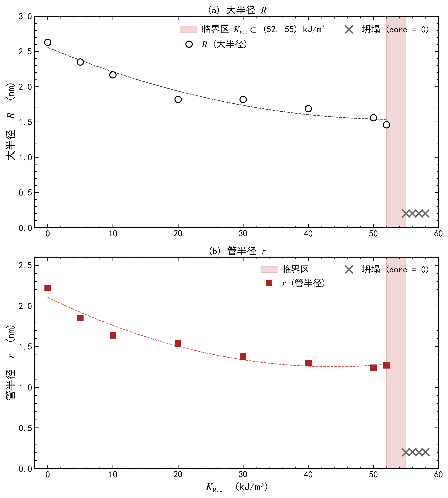
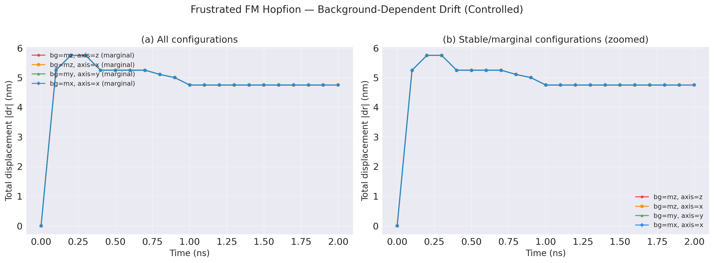
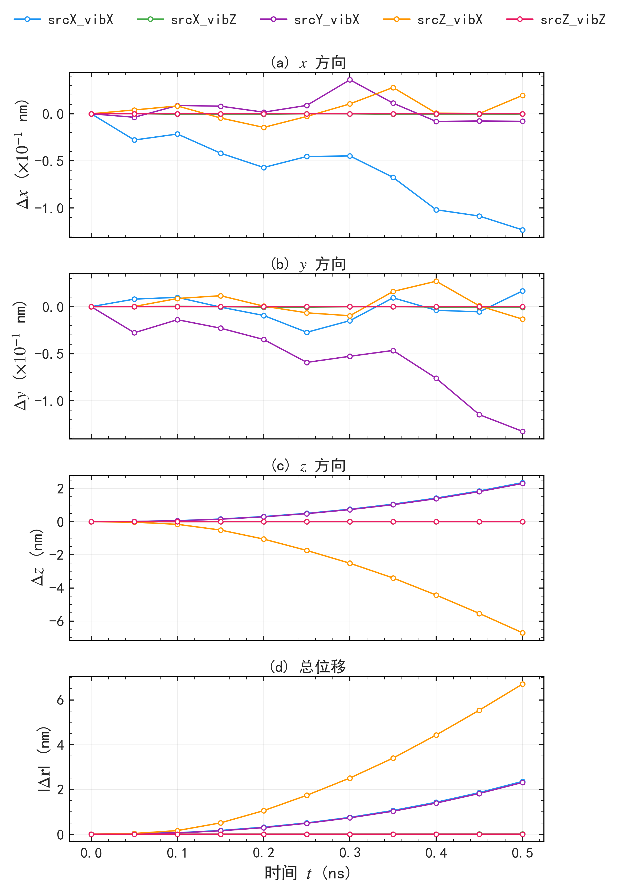
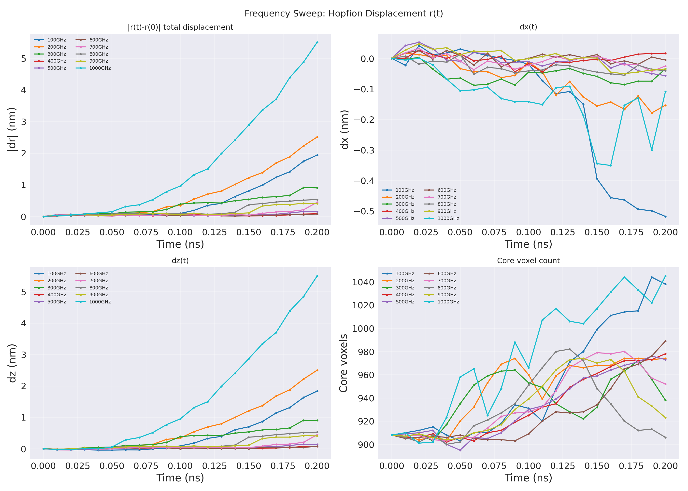
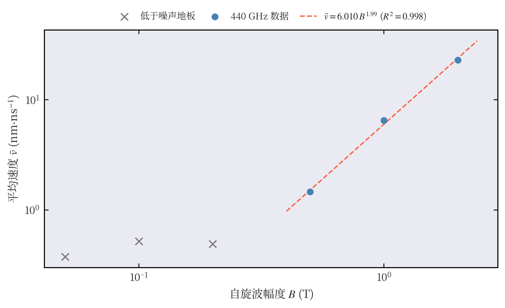
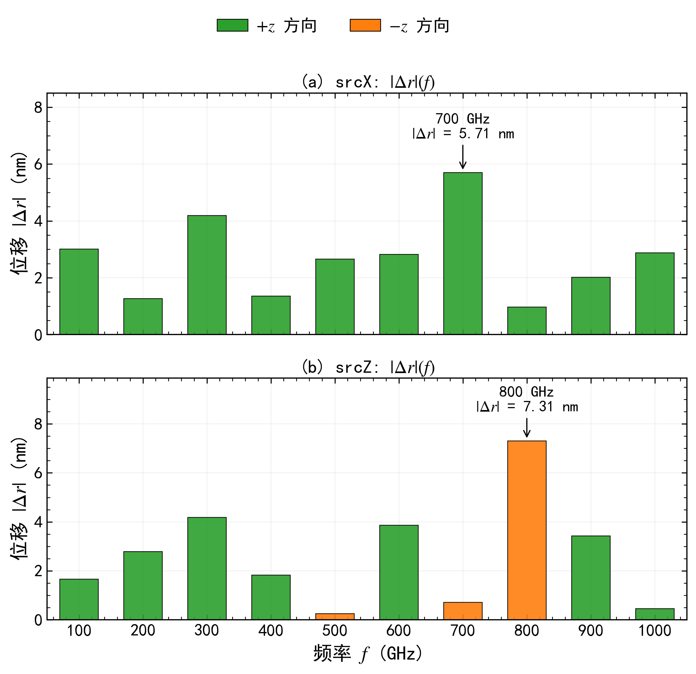
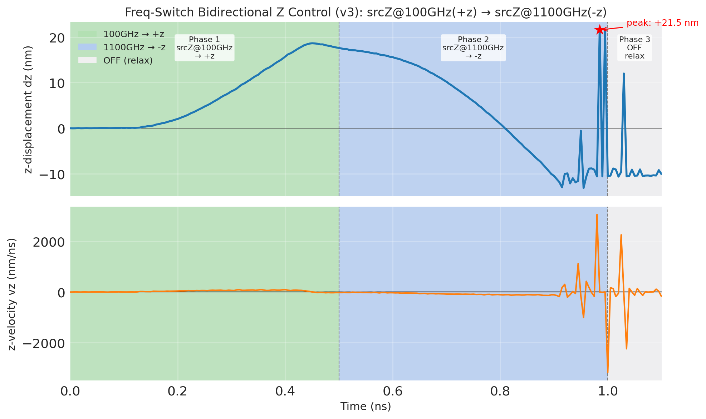
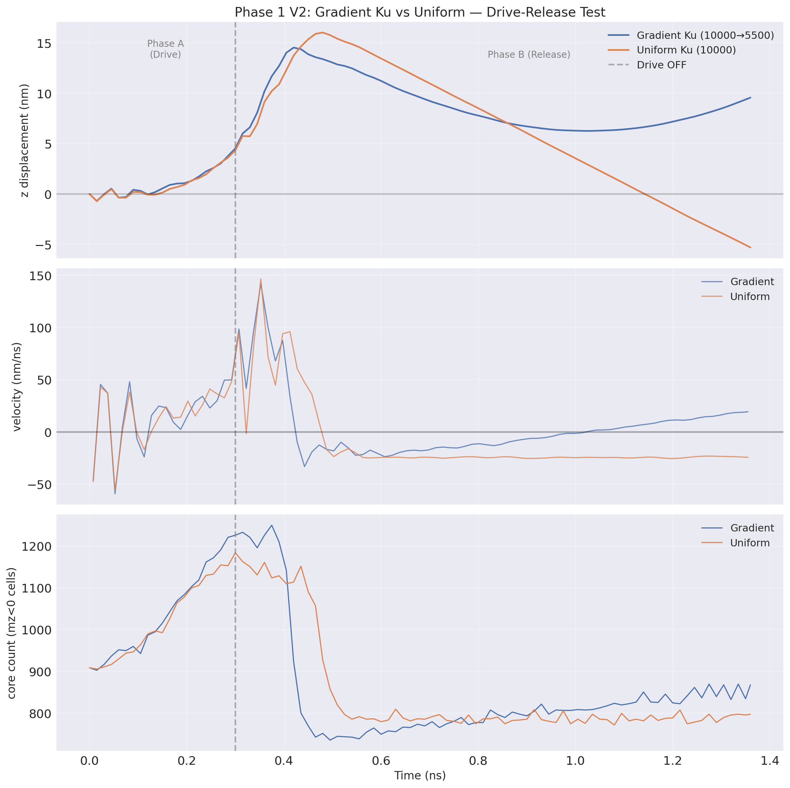
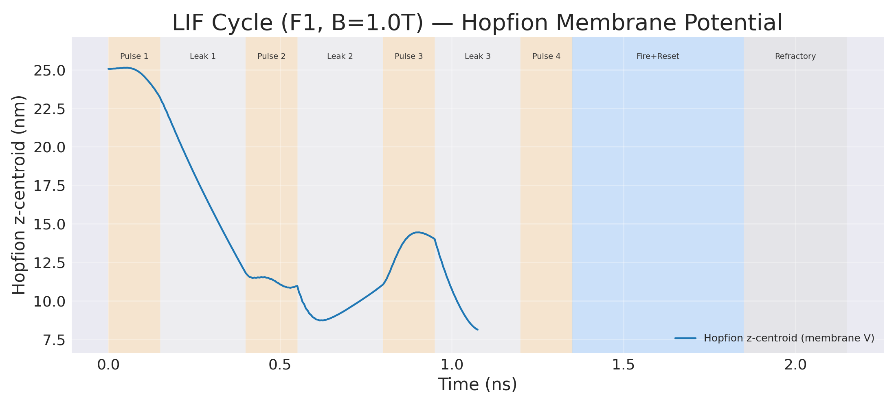

# Hopfion 项目研究结果汇报 — 文字稿

吴佳乐 2026-06-02

---

## P1 — Frustrated FM 稳态尺寸

无 DMI 体系，参数：100³ 格点 / 0.5 nm cell / PBC(1,1,1) / Ms=1.5e5 / Aex=5e-12 / J2=-0.164·J1 / J4=-0.082·J1。

size_sweep 两次实验：R8r4 初始 + R12r5 初始，Ku=0 下分别弛豫。两者都收敛到相同的稳态尺寸 R=2.60 nm。R12r5 收缩到 R=2.60，R8r4 膨胀到 R=2.60。

稳态尺寸由材料体系参数（Ku, J2/J4, Aex, Ms）决定，与初态尺寸无关。换材料体系则稳态值漂移。

无图（可加 bishe fig3-3_size_convergence）。来源：`20260105_frustrated_fm/size_sweep/`

---

## P2 — Frustrated FM 居中稳态（三组 Ku）

centered_stability_test：把 Hopfion 平移到盒子中心，验证不同 Ku 下的居中稳态。

| 配置 | 1ns z 漂移 | 结果 |
|---|---|---|
| Ku=0 | +0.70 nm | PASS（呼吸模式）|
| Ku=10k | -0.019 nm | PASS（最稳，选为 SW 初始态）|
| Ku=50k | +0.062 nm | PASS |

判定：1 ns z-center 漂移 <2 nm。三组全过。Ku=10k 输出 m000020.ovf 作为后续自旋波动力学全部仿真的公共初始态。

来源：`20260105_frustrated_fm/centered_stability_test/`

---

## P3 — Ku 临界扫描（13 点）

anisotropy_study/ku_critical_sweep：固定 R8r4 初始，扫描 Ku=0 / 5k / 10k / 20k / 30k / 40k / 50k / 52k / 55k / 56k / 57k / 58k 共 13 个点。

现象 + 结论：Ku 增大 Hopfion 单调收缩。R8r4 体系下，约 52–55 k 区间 Hopfion 结构坍塌。具体临界值 Ku_c 因材料体系而异（R3r2、R12r5 各不同），非研究优先级。

来源：`20260105_frustrated_fm/anisotropy_study/ku_critical_sweep/`

---

## P4 — size_vs_ku + 拓扑荷 Q_H=1 验证

anisotropy_study/size_vs_ku：R12r5 起始，扫描 Ku=0 / 2.5k / 5k / 10k / 12k 等共 6 个点，研究 R(Ku) 依赖关系。与 ku_critical_sweep 互补。

compute_hopf_index.py 对当前体系所有 Hopfion 初始态做 Q_H 数值验证：结果均为 Q_H=1。Q_H=2 (p=1,q=2) 和 Q_H=4 在 frustrated FM 体系下的稳定性从未仿真，是下一步方向。

来源：`20260105_frustrated_fm/anisotropy_study/size_vs_ku/` + `compute_hopf_index.py`

---

## P5 — 漂移旧实验

drift_experiments 旧实验：
- bg_mx_axis_x_stable：alpha=5.0, R8r4, 10 ns 长跑，200 帧
- bg_my_axis_y_stable：1 ns 短跑，20 帧

当初结论：bg=mz 漂移、bg=mx,my 稳定。该结论已写入毕设论文 ch03 §3.2.3 早期版本。

来源：`20260105_frustrated_fm/drift_experiments/{bg_mx_axis_x_stable, bg_my_axis_y_stable}/`

---

## P6 — 漂移结论推翻：unified_rerun 控制变量

unified_rerun：4 组统一参数（alpha=0.2, Ku=0, R3r2, 2 ns），bg=mx/my/mz × axis 组合。

结果：4 组完全一致，bg 方向无影响。旧结论推翻。

真实机理：前 1 ns 轴向格点递举弛豫 4.75 nm，之后钉扎。漂移与背景磁化方向无关。

毕设 ch03 §3.2.3、ch06 已同步修正；fig3-4_drift_comparison.png 重新生成入论文。

来源：`20260105_frustrated_fm/drift_experiments/unified_rerun/`（4 组 + continue）

---

## P7 — 自旋波方向选择性（5 组）

drive_selection/plane_wave 5 次仿真：srcX×vibX, srcX×vibZ, srcY×vibX, srcZ×vibX, srcZ×vibZ。

结论：
- vibX 强耦合，vibZ 无耦合
- srcX 与 srcY 完全等价（面内对称性）
- vibZ 路径下 Hopfion 几乎不动

后续所有自旋波仿真默认 vib 方向 = X。

来源：`20260105_frustrated_fm/spin_wave_dynamics/drive_selection/plane_wave/`

---

## P8 — 平面源 srcX 频率扫描（14 频率）

freq_sweep/plane_wave/srcX：02ns 段 10 频率（100/200/300/400/500/600/700/800/900/1000 GHz）+ 05ns 段 4 频率（100/200/500/1000 GHz）。

结论：100-200 GHz、1000 GHz 强响应；400-600 GHz 死区（位移近零）；Hopfion 沿 +z 方向运动（垂直波传播方向）。

来源：`20260105_frustrated_fm/spin_wave_dynamics/freq_sweep/plane_wave/srcX/{02ns, 05ns}/`

---

## P9 — 平面源 srcZ 频率扫描（20 频率）

freq_sweep/plane_wave/srcZ：coarse 10 频率 + fine 10 频率，总共 20 个频率点（100-1500 GHz 区间）。

结论：
- 1100 GHz 全频段最强响应：|dz| = 18.1 nm，方向 -z
- 100 GHz 异常：方向 +z（与其他频率相反）
- 死区：75 / 150 / 600 / 1300 GHz
- 整体趋势：srcZ → -z（沿波传播方向）

来源：`20260105_frustrated_fm/spin_wave_dynamics/freq_sweep/plane_wave/srcZ/`

---

## P10 — srcX 幅度扫描 @440 GHz（旧标度律已推翻）

amplitude_sweep/plane_wave 6 点：B = 0.05 / 0.1 / 0.2 / 0.3 / 0.5 / 0.7 / 1.0 / 2.0 T 等。

毕设原结论：v∝B¹·⁹⁹ 幂律（仅基于 B=0.5/1.0/2.0 T 三点拟合）。

已推翻：
- 拟合点过少（仅 3 点）
- B≤0.2 T 数据被排除为"噪声"（|dr|<0.1 nm）
- B=0.05 / 0.1 T 实际朝源运动 -z，B≥0.2 T 远离源 +z
- 方向反转阈值 Bc ∈ (0.1, 0.2) T 未精确定位
- B=5 T 高场点未验证幂律是否外推

现状：方向反转 + 幂律两个现象并存，但准确标度律和精确 Bc 都未确定。

来源：`20260105_frustrated_fm/spin_wave_dynamics/amplitude_sweep/plane_wave/`

---

## P11 — srcZ 幅度扫描 @1100 GHz（cron 跑，部分数据）

amplitude_sweep/plane_wave_srcZ：B=0.1 / 0.5 / 1.0 / 1.5 / 2.0 T 等约 6 点 @1100 GHz cron 进行。当前数据回收状态不全，未整理分析。

在已完成 B 点上，Hopfion 沿 -z 漂移幅度大致随 B 增大。无量化标度律结论。

来源：`20260105_frustrated_fm/spin_wave_dynamics/amplitude_sweep/plane_wave_srcZ/`

---

## P12 — 单源双向 z 控制（结论）

综合 P8 P9：仅靠平面源、单一频率、改换激发位置，就实现 Hopfion 沿 ±z 双向运动：
- srcX → +z（垂直传播）
- srcZ → -z（沿传播）

这是后续多源 freq_switch 实验的物理基础。

---

## P13 — 点源 srcX 频率扫描（10 频率）

freq_sweep/point_source/srcX：DefRegionCell(7, 30, 50, 50) 单格 0.5 nm³，B_amp=500 T（对比平面源 1 T 薄片层）。10 频率 100-1000 GHz。

结论（B 设备数据迁回 2026-04-09）：
- 最强响应：700 GHz，|dr| = 5.71 nm（vs 平面源 1000 GHz）
- 全频段 +z，与平面源 srcX 一致
- 死区消失（平面源有 400-600 GHz 死区）
- Hall 角 69-89°，保持高 Hall 角拓扑特征

来源：`20260105_frustrated_fm/spin_wave_dynamics/freq_sweep/point_source/srcX/`

---

## P14 — 点源 srcZ 频率扫描（10 频率）

同 P13 参数，srcZ 位置。

结论：
- 最强响应：800 GHz，|dr| = 7.31 nm，方向 -z（vs 平面源 1100 GHz）
- 方向分布更复杂：100/200/300/400 / 600 / 900 GHz +z，500 / 700 / 800 GHz -z（vs 平面源仅 100 GHz 异常）
- Hall 角 9-40°（vs 平面源 ~1°），对称性部分破坏

核心结论（综合 P13 P14）：振荡方向选择性、运动方向、Hall 角等本质由 Hopfion 拓扑决定，不依赖激励几何。点源改变共振分布细节，未改变基本物理图像。

来源：`20260105_frustrated_fm/spin_wave_dynamics/freq_sweep/point_source/srcZ/`

---

## P15 — 点源幅度扫描（部分完成）

amplitude_sweep/point_source @1100 GHz：

| B | 状态 |
|---|---|
| B100 / B200 / B300 / B400 | 完成 |
| B500 | 停在 0.433 ns，未续跑成功 |
| B700 / B1000 / B2000 | 未跑 |

已完成的 B100-B400 显示 Hopfion 位移随 B 增大但尚无完整 v(B) 曲线，无标度律结论。

来源：`20260105_frustrated_fm/spin_wave_dynamics/amplitude_sweep/point_source/`

---

## P16 — 多源基线 + 双向 z v1

baseline：srcX + srcZ 同时激发 @单一频率 → Hopfion 仅 +z，未实现反转。

bidirectional_z v1（z_bidirectional_control）：双源叠加 + 反相设计 → Hopfion 仍仅 +z。

结论：单纯空间叠加双源不足以实现双向 z 控制，需要时序切换。

来源：`20260105_frustrated_fm/spin_wave_dynamics/multisource_control/{baseline, bidirectional_z/v1}/`

---

## P17 — freq_switch v2 v3 双向 z 控制（含坍塌真相）

freq_switch v2（Phase1=0.10ns / Phase2=0.40ns）：
- Phase1 100 GHz：Hopfion 仅 +0.04 nm（Phase1 太短）
- Phase2 1100 GHz：Hopfion 到 -18.7 nm
- 双向 FAILED：未观察到 +z → -z 完整反转

freq_switch v3（Phase1=0.50ns / Phase2=0.50ns）：
- Phase1 100 GHz：0 → +17.6 nm（PASS）
- Phase2 1100 GHz：+17.6 nm → -12.9 nm（反转 SUCCESS）
- t ≈ 0.91 ns Hopfion 拓扑结构坍塌，core=0（毕设展示截到 0.80 ns，未提坍塌，本次完整呈现到 1.00 ns）

失败根因：1100 GHz 推 -z 力量过强（耦合 ~74 nm/ns，远超 Phase1 的 ~35 nm/ns），Phase2 持续 0.30 ns 形变累积过临界。

方案 A 调参（未实施）：Phase2 脉宽 → 0.05-0.10 ns；Phase2 振幅 → 0.3-0.5 T；后接 0 场维持。

来源：`20260105_frustrated_fm/spin_wave_dynamics/multisource_control/bidirectional_z/`

---

## P18 — LIF Phase 1：梯度 Ku 恢复力验证（PASS）

lif_neuron_hopfion/gradient_ku_verification：drive-release 实验对照。

- gradient_ku_drive_release：100 GHz drive 0.3 ns → OFF 2 ns，Ku 梯度（10000→5500，沿 z 方向 10 区）
- uniform_ku_drive_release：对照，固定 Ku=10000

结论 PASS：
- gradient 在 +7.8 nm 收敛（near-critical damping）
- uniform 在原点附近持续振荡（underdamped）
- 梯度 Ku 提供了清晰的恢复力

意外发现：Hopfion 偏好低 Ku 区（gradient 平衡在 Ku≈7500 端，即 +z 端），与初始假设"Hopfion 趋向高 Ku 区"相反。Phase 2 设计因此需要反转源-初态位置。

来源：`lif_neuron_hopfion/gradient_ku_verification/drive_release_test/`

---

## P19 — LIF Phase 2 F1：脉冲列 integrate（FAILED）

lif_cycle_demo/pulse_train_integrate：4 脉冲 @1100 GHz（0.15 ns on / 0.25 ns gap） + 100 GHz fire + 不应期，总 2.15 ns。

FAILED，t=1.089 ns kill（6h49m 跑了 49.5%）。

OVF 坐标系修正后真实轨迹：0 → Leak1 末 -6.76 nm → Pulse2 末 -13.93 nm → Leak3 末 -16.95 nm（持续 overshoot，未稳定）。

失败原因：
1. 1100 GHz 推 -z 方向，与梯度 Ku 恢复力 +z 同向（不是反向），Hopfion 单向漂移
2. Leak 期 Hopfion 继续 overshoot，残余自旋波能量 >> 梯度恢复力
3. Phase 1 V2 在 100 GHz 下的"低 Ku 偏好"不能外推到 1100 GHz

来源：`lif_neuron_hopfion/lif_cycle_demo/pulse_train_integrate/`

---

## P20 — LIF Phase 2 重设计候选（未开工）

4 个候选方向：
- 方案 A：反转源-初态相对位置（initial 在 -z 端高 Ku，integrate 用 100 GHz → +z，梯度自然拉回 -z，fire 用反向冲击）
- 方案 B：降低 1100 GHz 幅度（B=0.3 T） + 延长 leak gap（0.5 ns）让自旋波耗散
- 方案 C：缩短 pulse 宽（0.15 → 0.05 ns）减少单次注入能量
- 方案 D：双频叠加 integrate（1100 GHz 短冲 + 立即 100 GHz 反向短冲抑制残余自旋波）

仅 sub-threshold 对照（B=0.1 T）脚本就绪：`subthreshold_B0p1T.mx3`。

未开工，等定方案。

来源：`lif_neuron_hopfion/lif_cycle_demo/`（脚本就绪）

---

## P21 — 旧版本对标：My_old_simulation（系数错误）

old_results/My_old_simulation/ 共 20 个 srcX/srcZ point source freq sweep。含 J2/J4 系数符号错误。

具体陷阱：J2 / J4 在 frustrated FM 模型里有正负号约定，不同文献存在差异。旧版本采用了错误符号约定。

与当前正确版本对比：拓扑荷数值差异约 2-3%；动力学定性趋势相同但定量结果不可比。

经验：复用别人代码时必须验证符号；从已验证的 R8r4_Ku0.mx3 拷参数，不要从公式重推。

来源：`old_results/My_old_simulation/A材料尺寸对hopfion的影响/`

---

## P22 — Device B 验证 + srtp 学生项目

deviceB_package：用户次要 Windows 机器独立运行 srcZ freq sweep 9 个验证。结果与主机一致，作为独立机器交叉验证。

srtp/：早期学生项目存档。
- hopfion_mumax3/1.spinwave & magnetic field x/：早期自旋波驱动
- magnon-hopfion-main/：振荡-Hopfion 耦合，未完成
- draw_hopfion/：早期可视化

历史价值：展示项目早期摸索过程，与当前体系参数差异较大，不可直接复用。

来源：`deviceB_package/`、`srtp/`

---

## P23 — 现状清单

跑完且有清晰结论：Frustrated FM 稳态尺寸（与初态无关，与体系参数有关） / 居中稳态 Ku 三组 / Ku 临界趋势 / Q_H=1 验证 / 漂移机理修正 / 方向选择性 vibX/vibZ / srcX/srcZ 频率响应 / 单源双向 z 可控性 / 点源 vs 平面源对比 / LIF Phase 1 梯度恢复力 + Hopfion 偏好低 Ku

跑完但未归纳完整结论：amplitude_sweep srcX 旧标度律已推翻、新拟合未确定 / freq_switch v3 反转成功但坍塌后无后续

停在半路：amplitude_sweep srcZ cron 部分缺失 / amplitude_sweep point B500 停在 0.433 ns / freq_switch v3 坍塌后未续 / LIF Phase 2 F1 在 1.089 ns kill

从未启动：Q_H=2 / Q_H=4 稳定性验证 / freq_switch v3 方案 A 调参 / LIF Phase 2 重设计 4 候选
