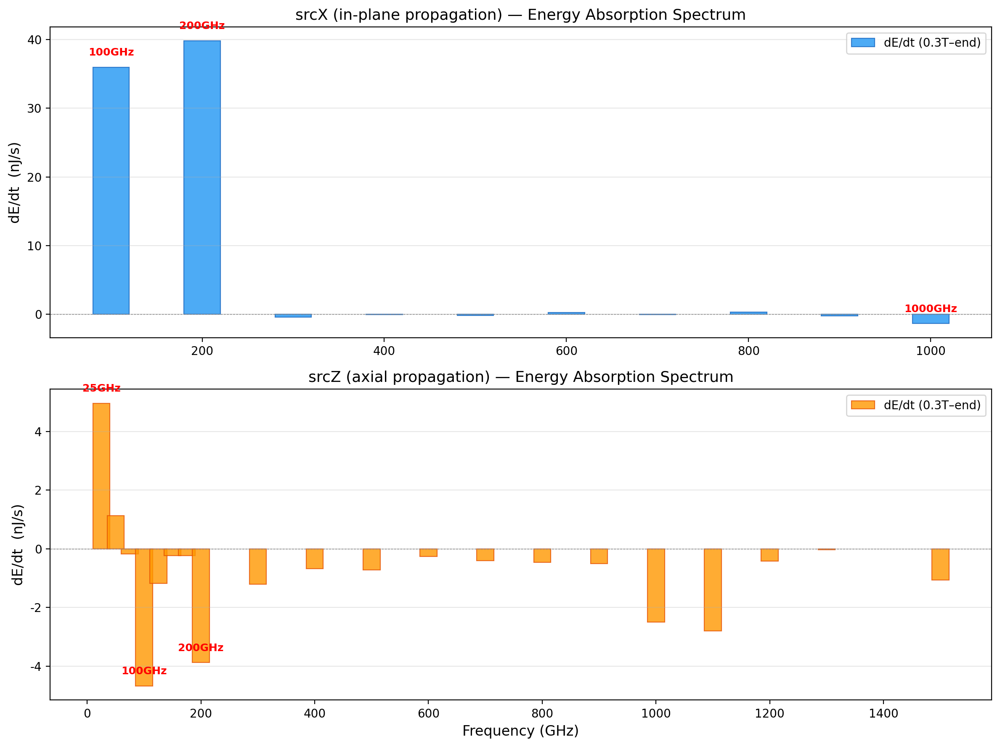
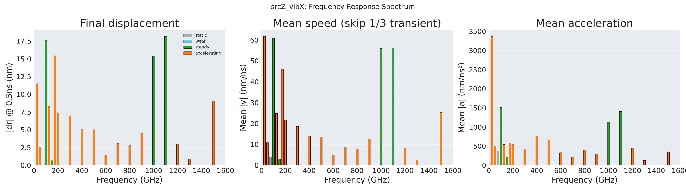
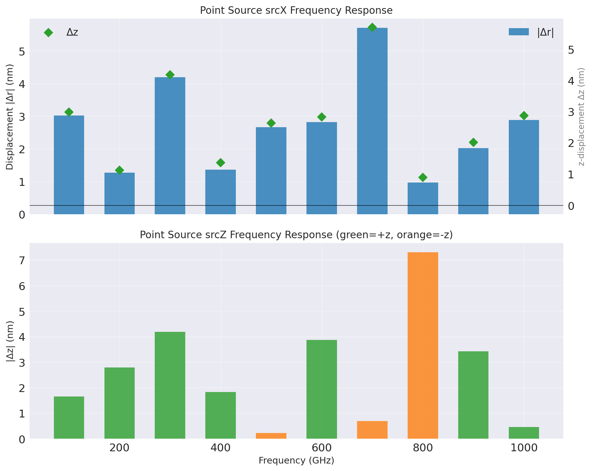

# Skyrmion 固有频率理论与 Hopfion 自旋波驱动频率联系调研

生成日期：2026-06-08  
关联 bd：`Hopfion-e2m`

## 结论先行

可以联系，但要分层联系。

Skyrmion 文献里最成熟的做法不是直接把某个驱动频率峰叫作固有频率，而是先用脉冲激发或线性化本征值问题得到本征模，再用选择定则、吸收谱和空间模态确认该频率对应 breathing、CW/CCW gyrotropic 或更高阶 localized magnon mode。按这个标准，我们当前 Hopfion 数据已经有“候选本征耦合频率”和“强驱动位移窗口”，但还没有完成严格的本征频率鉴定。

当前最稳的对应关系是：平面源 `srcX` 的能量吸收峰指向 `200 GHz`，位移响应另有 `1000 GHz` 强峰；平面源 `srcZ` 的位移强峰在 `100/1000/1100 GHz`，但能量斜率摘要把 `100 GHz` 标成最强响应；点源相对平面源出现 `srcX 1000 -> 700 GHz`、`srcZ 1100 -> 800 GHz` 的红移。这一组现象可以借用 skyrmion 文献中的三条理论语言解释：模式选择定则、频率依赖的 magnon scattering / reflectivity、强非线性激发导致的红移与坍塌。

## 文件导览

- [notes/skyrmion_theory_methods.md](notes/skyrmion_theory_methods.md)：skyrmion 固有频率文献的方法拆解。
- [notes/hopfion_connection_assessment.md](notes/hopfion_connection_assessment.md)：把 skyrmion 方法迁移到我们 Hopfion 结论上的判断。
- [notes/proposed_analysis_pipeline.md](notes/proposed_analysis_pipeline.md)：下一步若要严谨证明 Hopfion 固有频率，建议采用的分析流程。
- [tables/literature_matrix.md](tables/literature_matrix.md)：核心文献矩阵。
- [tables/hopfion_frequency_evidence.md](tables/hopfion_frequency_evidence.md)：本项目已有频率证据整理。
- [sources/source_links.md](sources/source_links.md)：网页文献与本地证据路径。
- [figures/](figures/)：从现有仿真结果复制出的关键展示图。

## 展示用一句话

Skyrmion 的理论研究告诉我们，固有频率要通过“脉冲谱或本征值问题 + 选择定则 + 空间模态”确认；我们当前 Hopfion 的自旋波频率扫描已经看到与这些理论范式相同的模式选择、红移、强驱动坍塌现象，因此可以作为 Hopfion 本征模研究的入口，但需要补上自由振荡 FFT 和空间模态图才能把位移峰升级为严格固有频率。

## 附图索引

